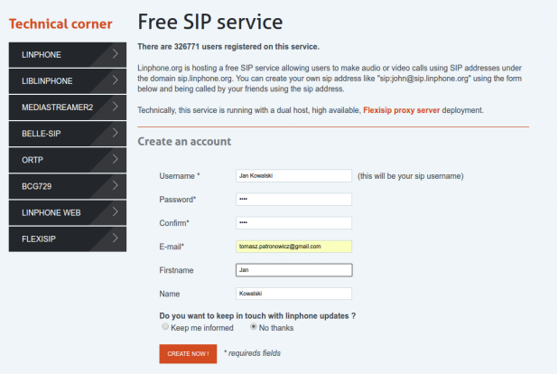

<h1><strong><strong>User&nbsp;&nbsp;Documentation</strong></strong></h1>

<strong><strong>SIP&nbsp;PHONE&nbsp;APPLICATION</strong></strong>

<a href="#_Toc1594897694">General Information</a><a href="#_Toc74001385">Short project&rsquo;s description.</a>

<a href="#_Toc699569180">Sip Account Registration</a>

<a href="#_Toc573572300">Application </a>

<a href="#_Toc1177406696 ">Installation</a>

<a href="#_Toc536674846 ">Configuration</a>

<a href="#_Toc683986093 ">First&nbsp;Call&nbsp;</a>

<h1><strong>&nbsp;</strong><strong><strong>General&nbsp;Information</strong></strong></h1>
<h2>1<strong>.&nbsp;</strong><strong><strong>Short&nbsp;project&rsquo;s&nbsp;description.</strong></strong></h2>

SIPphone&nbsp;is&nbsp;a&nbsp;pure&nbsp;SIP&nbsp;app&nbsp;for&nbsp;Android.&nbsp;

<h2>2<strong><em>.&nbsp;</em></strong><strong><em><strong><em>Sip&nbsp;Account&nbsp;Registration</em></strong></em></strong></h2>

User&nbsp;needs&nbsp;to&nbsp;register&nbsp;for&nbsp;a&nbsp;sip&nbsp;account&nbsp;in&nbsp;the&nbsp;SIP&nbsp;server&nbsp;provider.&nbsp;The&nbsp;registration&nbsp;is&nbsp;essential&nbsp;to&nbsp;start&nbsp;using&nbsp;this&nbsp;app.&nbsp;&nbsp;It&nbsp;can&nbsp;be&nbsp;done&nbsp;through&nbsp;f.e&nbsp;LinePhone,&nbsp;&nbsp;Free&nbsp;SIP&nbsp;service&nbsp;on&nbsp;the&nbsp;website:

&nbsp;<a href="https://www.linphone.org/free-sip-service.html?page=free-sip-service.html"><u>https://www.linphone.org/free-sip-service.html?page=free-sip-service.html</u></a>

<em><em>Image&nbsp;</em></em><em><em>1</em></em><em><em>&nbsp;User&nbsp;registration&nbsp;for&nbsp;a&nbsp;free&nbsp;SIP&nbsp;account</em></em>

User&nbsp;needs&nbsp;to&nbsp;give&nbsp;the&nbsp;basic&nbsp;data&nbsp;as&nbsp;username,&nbsp;password,&nbsp;valid&nbsp;email&nbsp;address&nbsp;and&nbsp;first&nbsp;and&nbsp;last&nbsp;name&nbsp;(image&nbsp;1).&nbsp;After&nbsp;registration&nbsp;and&nbsp;email&nbsp;confirmation&nbsp;SIP&nbsp;account&nbsp;is&nbsp;ready&nbsp;to&nbsp;use.&nbsp;The&nbsp;user&nbsp;gets&nbsp;a&nbsp;login&nbsp;data&nbsp;provided&nbsp;as&nbsp;an&nbsp;email&nbsp;message&nbsp;(image&nbsp;2).

&nbsp;<strong><strong>&nbsp;</strong></strong>

<em><em>Image&nbsp;</em></em><em><em>2</em></em><em><em>&nbsp;User&nbsp;can&nbsp;find&nbsp;login&nbsp;data&nbsp;in&nbsp;the&nbsp;email&nbsp;message&nbsp;after&nbsp;email&nbsp;confirmation</em></em>

<h1><strong><strong>Application</strong></strong></h1>
<h2>3<strong>.&nbsp;</strong><strong><strong>Installation</strong></strong></h2>

This&nbsp;app&nbsp;is&nbsp;installed&nbsp;as&nbsp;a&nbsp;standard&nbsp;Android&nbsp;application.&nbsp;It&nbsp;gets&nbsp;access&nbsp;to&nbsp;making/receiving&nbsp;SIP&nbsp;calls,&nbsp;recording&nbsp;audio,&nbsp;controlling&nbsp;phone&nbsp;vibration&nbsp;and&nbsp;changing&nbsp;audio&nbsp;settings&nbsp;(image&nbsp;3&nbsp;).

<em><em>Image&nbsp;</em></em><em><em>3</em></em><em><em>&nbsp;SipPhone&nbsp;Installation</em></em>

After&nbsp;Installation&nbsp;user&nbsp;can&nbsp;find&nbsp;this&nbsp;app&nbsp;in&nbsp;the&nbsp;standard&nbsp;android&nbsp;menu

&nbsp;&nbsp;

<h2>4<strong><em>.&nbsp;</em></strong><strong><em><strong><em>Configuration</em></strong></em></strong></h2>

After&nbsp;installation&nbsp;user&nbsp;needs&nbsp;to&nbsp;set&nbsp;up&nbsp;this&nbsp;application.&nbsp;It&nbsp;can&nbsp;be&nbsp;done&nbsp;&nbsp;by&nbsp;clicking&nbsp;&nbsp;&rdquo;Edit&nbsp;your&nbsp;SIP&nbsp;info&rdquo;&nbsp;in&nbsp;the&nbsp;main&nbsp;view&nbsp;(image&nbsp;4).

<em><em>Image&nbsp;</em></em><em><em>4</em></em><em><em>&nbsp;Main&nbsp;menu</em></em>

After&nbsp;that&nbsp;user&nbsp;needs&nbsp;to&nbsp;fill&nbsp;out&nbsp;SIP&nbsp;username,&nbsp;Domain&nbsp;for&nbsp;SIP&nbsp;Account,&nbsp;Outbound&nbsp;Proxy&nbsp;Address&nbsp;and&nbsp;password&nbsp;(image&nbsp;5).&nbsp;All&nbsp;required&nbsp;data&nbsp;were&nbsp;sent&nbsp;after&nbsp;SIP&nbsp;account&nbsp;registration.&nbsp;

<em><em>Image&nbsp;</em></em><em><em>5</em></em><em><em>&nbsp;User&nbsp;account&nbsp;settings</em></em>

If&nbsp;user&nbsp;filled&nbsp;out&nbsp;this&nbsp;form&nbsp;with&nbsp;right&nbsp;data&nbsp;the&nbsp;application&nbsp;is&nbsp;ready&nbsp;to&nbsp;use&nbsp;(image&nbsp;6).

<em><em>Image&nbsp;</em></em><em><em>6</em></em><em><em>&nbsp;App&nbsp;is&nbsp;ready&nbsp;to&nbsp;use&nbsp;</em></em>

It&nbsp;can&nbsp;happen&nbsp;that&nbsp;data&nbsp;are&nbsp;wrong&nbsp;or&nbsp;there&nbsp;is&nbsp;no&nbsp;connection&nbsp;to&nbsp;the&nbsp;server.&nbsp;After&nbsp;that&nbsp;user&nbsp;gets&nbsp;an&nbsp;information&nbsp;(image&nbsp;7).&nbsp;

<em><em>Image&nbsp;</em></em><em><em>7</em></em><em><em>&nbsp;Registaration&nbsp;failed</em></em>

&nbsp;<strong><em>&nbsp;</em></strong>

<h2>5<strong><em>.&nbsp;</em></strong><strong><em><strong><em>First&nbsp;Call&nbsp;</em></strong></em></strong></h2>
<h2><strong><em><strong><em>&nbsp;</em></strong></em></strong></h2>

If&nbsp;user&nbsp;gets&nbsp;on&nbsp;the&nbsp;screen&nbsp;a&nbsp;word&nbsp;&ldquo;Ready&rdquo;&nbsp;in&nbsp;the&nbsp;main&nbsp;app&nbsp;view&nbsp;it&nbsp;can&nbsp;be&nbsp;made&nbsp;a&nbsp;first&nbsp;call.&nbsp;In&nbsp;the&nbsp;menu&nbsp;user&nbsp;needs&nbsp;to&nbsp;choose&nbsp;&ldquo;Call&nbsp;someone&rdquo;&nbsp;option.&nbsp;The&nbsp;user&nbsp;contact&nbsp;is&nbsp;in&nbsp;a&nbsp;format&nbsp;of&nbsp;username@domain&nbsp;(image&nbsp;8).

<em><em>Image&nbsp;</em></em><em><em>8</em></em><em><em>&nbsp;Adding&nbsp;a&nbsp;user&nbsp;for&nbsp;a&nbsp;call</em></em>

If&nbsp;user&nbsp;needs&nbsp;to&nbsp;say&nbsp;something&nbsp;it&nbsp;is&nbsp;required&nbsp;to&nbsp;push&nbsp;a&nbsp;red&nbsp;star&nbsp;button&nbsp;on&nbsp;the&nbsp;main&nbsp;view.&nbsp;The&nbsp;SipPhone&nbsp;works&nbsp;like&nbsp;old&nbsp;Walkie-talkie&nbsp;concept&nbsp;(image&nbsp;9).

<em><em>Image&nbsp;</em></em><em><em>9</em></em><em><em>&nbsp;If&nbsp;user&nbsp;needs&nbsp;to&nbsp;say&nbsp;something&nbsp;it&nbsp;is&nbsp;required&nbsp;to&nbsp;push&nbsp;a&nbsp;red&nbsp;star&nbsp;button</em></em>

<h1><strong><strong>&nbsp;</strong></strong></h1>

